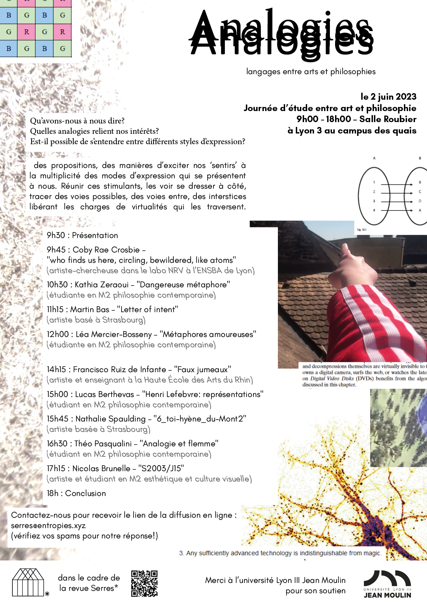

Transdisciplinary bilingual editon
Revue transdisciplinaire mensuelle bilingue

Serres* comes together as a few pages to invest in where multiple rhythms, forms and angles collide. A project for which its frame is diaphanous, a space for experimentation, fragile tests, beginnings, intuitions. Serres is the desire to share these thoughts, to give them shape, give them space, to make them relate in the in between of stages of a process. 

L’opération de mise en forme nous intéresse ; celle des idées, des impressions, des gestes, qui se fait à chaque instant de la vie et qui trouve dans les œuvres une intensité renouvelée. Il s’agit d’en proposer des figures, à partir de divers points de vue par lesquels entrevoir la réalité : arts visuels, philosophie, sciences, poésie, savoirs-faire et plus encore. Dans les édifices théoriques, esthétiques, imaginaires, nous pensons trouver une fenêtre sur le monde, à travers laquelle il se trouve d'un même acte présenté et transformé. Alors s'érigent, ravivées, notre attention et notre attente.

### \#2 - february 2025

### Analogies - juin 2023

### \#1 - march 2023

with the contributions of :

*   Lucie ([@nuktos\_hemera](https://www.instagram.com/nuktos_hemera/))
*   Sara Tremblay ([@saramenedutiff](https://www.instagram.com/saramenedutiff/))
*   Sasha Lithrue ([@sashalithrue](https://www.instagram.com/sashalithrue/))
*   Amandine ([@amandineteulier](https://www.instagram.com/amandineteulier/))
*   Francis Sandmann ([@exmackinaw](https://www.instagram.com/exmackinaw/))
*   Martin ([@meussieu\_martin](https://www.instagram.com/meussieu_martin/))
*   Mzioff ([@\_ntmzi](https://www.instagram.com/_ntmzi/))
